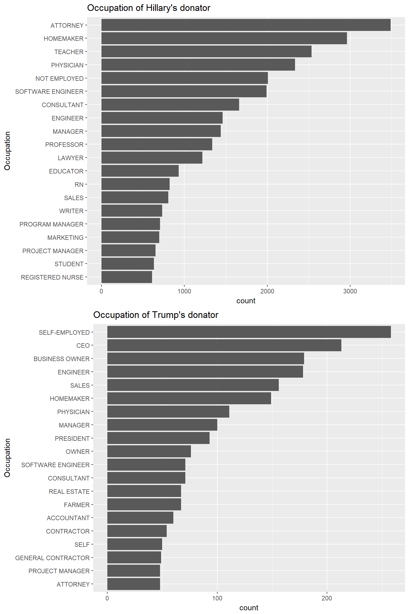
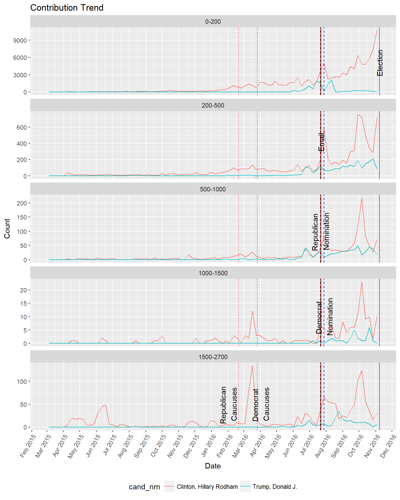

# Exploratory Data Analysis using R
Conduct exploratory data analysis and create an RMD file that explores the variables, structure, patterns, oddities, and underlying relationships of a data set.

# Data Set
Financial Contributions to Presidential Campaigns in Washington State.

# Final Plots and Summary

### Plot One

### Description One
After faceting by age, the plot shows that Hillary is more welcomed by female rather than male.

We can see that Hillary, Sanders and Trump are supported by both male and female across
all age groups.

Bush are supported by people from 25 to 60.

Paul, Rand is supported by elder female and young male. Strange!

### Plot Two

### Description Two
This is the most exicting plot in the whole analysis. The plot shows strong and interesting relation between contributor occupation and candidate's background.

As for Hillary, the top 1 occupation is attorney, and the 11th is lawyer. Yeah, we all know that Hillary once belong to this group

The second is homemaker, it tells that Hillary really welcomed by female.

We can also see that Hillary is welcomed by not employed and educate industry.

As for Trump, the top 1 occupation is self-employed. That is amazing. Perhaps Trump have some character appreciated by self-employed, such as courage.

And then we can see that in top 10, there are CEO, president, business owner, owner.

What is more, Trump also have a group donator with occupation like contractor, project manager, real estate.

The Hillary is supported by nurse while Trump is supported by farmer.

### Plot Three

### Description Three

Hillary's contribution went down to a valley after email controversy and then went up.

After the peak at around first week in October, the contribution slump down. Cannot figure out why.
Trump's contribution is steadily low compared with Hillary.

Though finally Hillary win in Washington State, it is hard to say there is really some strong relation between contribution and vote.

# Reflection

The contribution map shows that many district have no contribution at all. I don't know this is because of data quality or that is the truth. Maybe Washington State is not a good data set to analyze election compaign.

It is hard to figure out strong relation between election result and contribution since Trump paid himself.

There is really strong relation between contribution and date.

The strongest relation is candidate and their donators' occupation, which can be indicated by bar plot but not correlation.

Since contribution have limit and influence by many factor, I think building model to predict contribution is nearly impossible.

The data quality is not good enough and even missing due to different expreession, manual error and some other unknown reason.

It would be helpful to import some vote, demographic and geographic data to cross-validate and supply the election contribution data set.

I think using the larger dataset like the whole USA data set would discover some more interesting relation.
